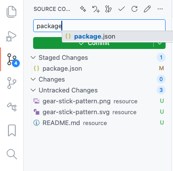

# Tingly Git

A VS Code extension that adds **convenient Git utilities** on top of VSCode's built-in Source Control.

> **Philosophy**: We extend VSCode's native Git with unique convenience features. No duplication, just smart enhancements to your daily Git workflow.

## Why Tingly Git?

VSCode's Source Control panel is excellent for Git basics. Tingly Git adds the **missing convenience features** that streamline your workflow:

| Feature                         | Why It Matters                                                                                          |
| ------------------------------- | ------------------------------------------------------------------------------------------------------- |
| **Smart Gitignore Templates**   | Browse & insert 50+ curated templates from GitHub's official collection - faster than manual copy-paste |
| **File History Log**            | Quick access to git log for any file - no terminal needed                                               |
| **Commit Message Autocomplete** | See staged files while typing commit messages - write better messages                                   |
| **Context Menu Staging**        | Right-click to add files - faster than opening Source Control panel                                     |

These are features **VSCode doesn't provide natively** - designed to save you time every day.

### Commands

Access via Command Palette (`Ctrl+Shift+P` / `Cmd+Shift+P`):

| Command                         | What It Does                                                  |
| ------------------------------- | ------------------------------------------------------------- |
| `Tingly Git: Manage .gitignore` | Browse and insert templates from GitHub's official collection |
| `Tingly Git: Log Current File`  | Show commit history for the active file                       |
| `Tingly Git: Add Remote`        | Add a named remote to your repository                         |

**Also available via context menu** - Right-click files/folders for "Git: Add File/Directory" and "Git: Log Current File".

### Context Menu

Right-click on:
- Files/Folders in explorer → "Git: Add File/Directory"
- Editor/tabs → "Git: Add File/Directory", "Git: Log Current File"

### Gitignore Templates

We fetch templates directly from **[github/gitignore](https://github.com/github/gitignore)** - the official, community-maintained collection.

Covering 50+ popular technologies:
- **Languages**: Node, Python, Go, Rust, Java, TypeScript, C++, C
- **Frameworks**: React, Vue, Angular, Next.js, Django, Laravel, Rails, NestJS
- **Mobile**: Android, iOS/macOS, Flutter, React Native
- **Tools**: VS Code, IntelliJ, Docker, Terraform, Kubernetes
- **Build Tools**: Maven, Gradle, Cargo, Composer, SBT

Just select what you need - we fetch and merge it into your `.gitignore` automatically.

### Commit Message Autocomplete

When writing commit messages in VSCode's Source Control input:
1. Press `Ctrl+Space` or `Cmd+I` to trigger suggestions
2. See all staged files with their paths
3. Type to fuzzy-filter (matches anywhere in the path)
4. Select to insert the file path into your message

Perfect for writing clear, descriptive commit messages that reference specific files.

## Usage

1. Install the extension from VSIX file
2. Open Command Palette (Ctrl+Shift+P)
3. Search for Tingly Git commands or use context menus
4. For gitignore: Search "Tingly Git: Manage .gitignore" to browse and add templates

### Requirements

- VS Code 1.90.0 or higher
- Git installed on your system

## Release Notes

### 0.260321.0
- **New gitignore source**: Switched from Toptal to GitHub's official gitignore collection
- **Curated templates**: 50+ popular technology templates directly from github/gitignore
- **Refactor**: Removed commands that duplicate VSCode native functionality
- **Focus**: Now focuses on unique convenience features only
- **Kept**: gitignore templates, file log, staged files autocomplete, context menu staging
- **Removed**: init, commit, push, pull, status, branch operations (use VSCode native)
- **Documentation**: Clarified positioning as a convenience layer on top of VSCode's built-in Git

### 0.260228.1800
- **Commit Message Autocomplete**: Smart file path completion in SCM commit input
  - Press `Ctrl+Space` or `Cmd+I` to call `Trigger Suggestion` to list staged files
  - Fuzzy filtering - type anywhere to filter paths
  - Quick file path insertion for better commit messages

### 0.25.121015
- **Major Feature**: Comprehensive .gitignore management system
  - Added 180+ professional gitignore templates from Toptal's collection
  - Automatic .gitignore creation when missing
  - Smart template merging with timestamp and source tracking
  - Enhanced user experience for template browsing and selection

### 0.0.1
- Initial release

## Support

Report issues on [GitHub](https://github.com/FFengIll/vscode-tingly-git)
