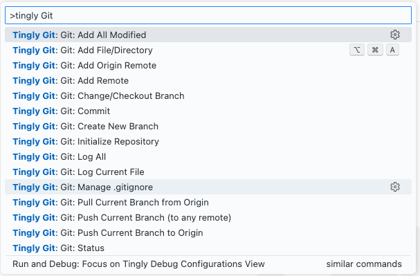

# Tingly Git

A VS Code extension that provides essential Git commands with context menu support, smart .gitignore management, and commit message autocompletion.

 

## Features

- **Git Commands**: Repository initialization, file operations, commit, push, pull, branching, and history
- **Context Menu Support**: Right-click on files and folders for quick Git operations
- **Gitignore Management**: Complete .gitignore management with 180+ professional templates from Toptal
- **Commit Message Autocomplete**: Smart file path completion in SCM commit input box
- **Smart Validation**: Detects ignored files with option to force add

### Commands

All Git operations are available via Command Palette (Ctrl+Shift+P) → "Git:":

- Repository: Initialize, Add Remote
- Files: Add File/Directory, Add All Modified
- Sync: Commit, Push, Pull
- Branching: Create, Checkout
- History: Log (All, Current File)
- Status: Check repository status
- Gitignore: Manage .gitignore templates

### Context Menu

Right-click on:
- Files/Folders in explorer → "Git: Add File/Directory"
- Editor/tabs → "Git: Add File/Directory", "Git: Log Current File"

### Gitignore Templates

Access 180+ professional gitignore templates covering:
- Programming languages (Python, JavaScript, Java, etc.)
- Frameworks (React, Vue, Django, etc.)
- Tools & IDEs (VS Code, IntelliJ, Docker, etc.)
- Build systems (npm, Maven, Gradle, etc.)
- Operating systems (Windows, macOS, Linux)

### Commit Message Autocomplete

When writing commit messages in the SCM input box:
- Press `Ctrl+Space` or `Cmd+I` to trigger suggestions
- Shows all staged files for quick reference
- Type to fuzzy-filter file paths (matches anywhere in the path)
- Select a file to insert its path into the message

## Usage

1. Install the extension from VSIX file
2. Open Command Palette (Ctrl+Shift+P)
3. Search for Git commands or use context menus
4. For gitignore: Search "Git: Manage .gitignore" to browse and add templates

### Requirements

- VS Code 1.90.0 or higher
- Git installed on your system

## Release Notes

### 0.260228.1800
- **Commit Message Autocomplete**: Smart file path completion in SCM commit input
  - Press `Ctrl+Space` or `Cmd+I` to call `Trigger Suggestion` to list staged files
  - Fuzzy filtering - type anywhere to filter paths
  - Quick file path insertion for better commit messages

### 0.25.121015
- **Major Feature**: Comprehensive .gitignore management system
  - Added 180+ professional gitignore templates from Toptal's collection
  - Automatic .gitignore creation when missing
  - Smart template merging with timestamp and source tracking
  - Enhanced user experience for template browsing and selection

### 0.0.1
- Initial release
  - All basic Git commands implemented
  - Context menu support for files and folders
  - Gitignore validation with force add option
  - Branch creation and checkout functionality
  - Git log commands for repository and individual files

## Support

Report issues on [GitHub](https://github.com/FFengIll/vscode-tingly-git)
